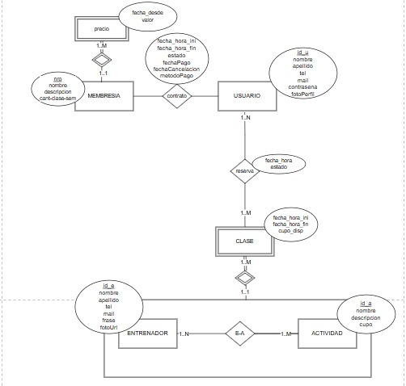

# GYM-DSW

Sistema de Gestión para Gimnasios

# Propuesta TP DSW

Este es un sistema web full stack diseñado para la administración de gimnasios. Permite gestionar usuarios, planes de entrenamiento, reservas de clases y planes.

## Grupo

### Integrantes

- 51027 - Arce Nahuel
- 50947 - Bolcatto Lucía Belén
- 51392 - Rallip Sánchez Ismael

### Repositorios

- [frontend app](https://github.com/luciabolcatto/frontendAppGym.git)
- [backend app](https://github.com/luciabolcatto/backendAppGym.git)

## Tema

### Descripción

Sistema web para la gestión de gimnasios. Permite la administración de usuarios (socios, entrenadores ), reservas de clases y control de pagos .

### Modelo

## Alcance Funcional

### Alcance Mínimo

Regularidad:
|Req|Detalle|
|:-|:-|
|CRUD simple|1. CRUD Actividad  2. CRUD Membresia  3. CRUD Usuario (Cliente)  |
|CRUD dependiente|1. CRUD Entrenador {depende de} CRUD Actividad  2. CRUD Clase {depende de} CRUD Entrenador |
|Listado + detalle| 1. Listado de usuarios filtrado por estado, muestra id Usuario, nombre y apellido Usuario, fecha_hora inicio , fecha_hora fin , fechaCancelacion , fechaPago , metodoPago y es[...]|
|CUU/Epic|1. Reservar clase.  2. Contratar Membresia|

Adicionales para Aprobación
|Req|Detalle|
|:-|:-|
|CRUD | CRUD Precio   |
|CUU/Epic|1. Cancelar reserva.  2. Contratar Membresia (Con restriccion y pago digital)  3. Valoración de Entrenadores y comentarios  |

### Alcance Adicional Voluntario

| Req      | Detalle                                                                                                                                                     |
| :------- | :---------------------------------------------------------------------------------------------------------------------------------------------------------- |
| Listados | A definir                                                                                                                                                |
| CUU/Epic | 1.                                                                                                                                                    |
| Otros    | 1. Notificaciones de transacciones  2. Pago digital con stripe   3. Restricción de comentarios (Vercel) 4. Login con Google 5. Recuperación de cuenta |
