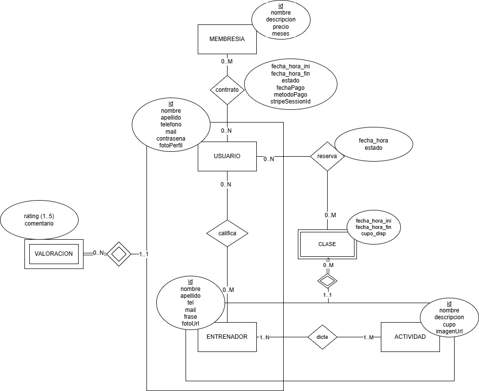

# GYM-DSW

Sistema de Gestión para Gimnasios

# Propuesta TP DSW

Este es un sistema web full stack diseñado para la administración de gimnasios. Permite gestionar usuarios, planes de entrenamiento, reservas de clases y planes.

## Grupo

### Integrantes

- 51027 - Arce Nahuel
- 50947 - Bolcatto Lucía Belén
- 51392 - Rallip Sánchez Ismael

### Repositorios

- [frontend app](https://github.com/luciabolcatto/frontendAppGym.git)
- [backend app](https://github.com/luciabolcatto/backendAppGym.git)

## Tema

### Descripción

Sistema web para la gestión de gimnasios. Permite la administración de usuarios (socios, entrenadores ), reservas de clases y control de pagos .

### Modelo

## Alcance Funcional

### Alcance Mínimo

Regularidad:
|Req|Detalle|
|:-|:-|
|CRUD simple|1. CRUD Actividad  2. CRUD Membresia  3. CRUD Usuario (Cliente)  |
|CRUD dependiente|1. CRUD Clase {depende de} CRUD Entrenador y CRUD Actividad  2. CRUD Contrato {depende de} CRUD Usuario y Membresia |
|Listado + detalle| 1. Panel de Administración de Usuarios: Listado global de socios con filtros por estado (Activo/Inactivo). El detalle muestra: ID, datos de contacto, historial de pagos (metodoPago, stripeSessionId) y fechas de vigencia de su membresía.  2. Grilla de Clases: Listado de clases programadas con filtro por actividad. El detalle permite ver el cupo real disponible y el entrenador asignado.|
|CUU/Epic|1. Reservar clase.  2. Contratar Membresia|

Adicionales para Aprobación
|Req|Detalle|
|:-|:-|
|CRUD | CRUD Valoración   CRUD Entrenador  |
|CUU/Epic|1. Cancelar reserva.   2. Valoración de Entrenadores  3. Pago digital con Stripe  |

### Alcance Adicional Voluntario

| Req      | Detalle                                                                                                                                                     |
| :------- | :---------------------------------------------------------------------------------------------------------------------------------------------------------- |
| Listados | 1.Perfil de Socio: Detalle de contratos activos e historial de reservas del usuario.                                                                     |
| CUU/Epic |                                                                                                                                                    |
| Otros    | 1. Automatización: Schedulers de Consistencia: Tareas programadas en el backend que cierran reservas iniciadas y vencen contratos automaticamente.   2. Seguridad: Webhooks con Firma Digital: Validación de eventos de Stripe mediante secretos de firma para garantizar la integridad de las transacciones financieras.   3. UX/Multimedia: Gestión de Archivos Estáticos: Carga de imágenes locales mediante Multer para personalizar actividades y perfiles.   4. Servicio de Mailing: Recuperación de contraseña y avisos de transacciones mediante Nodemailer y Gmail.   Arquitectura Basada en Capas: Separación estricta de controladores, entidades y servicios para facilitar el mantenimiento y escalamiento. |
